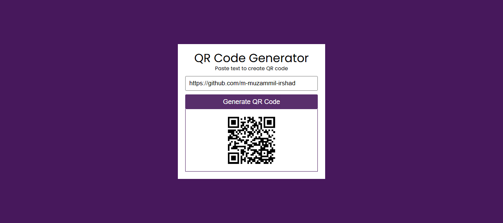

# 📱 QR Code Generator

A simple and responsive web app that allows you to generate QR codes instantly for any text or URL using a public API.

 

## 🚀 Features
- Generate QR codes for any text or URL
- Displays instantly on input
- Downloadable QR code image
- Responsive and clean UI

 

## 🛠️ Built With
- HTML
- CSS
- JavaScript
- [QR Code API](https://goqr.me/api/)

 

## 📷 Screenshot

 

## 📄 License
This project is licensed under the MIT License – see the [LICENSE](LICENSE) file for details.
